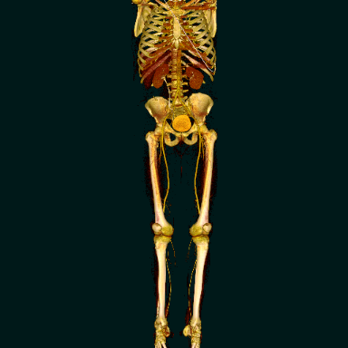

# MonkeyGL (Monkey Graphic Library)
>A fast 3d render library for the medical imaging.    
>All the calculations are based on the cuda (@Nvidia company).  
>Totally independent of the OpenGL context.

## install cuda
### linux (tested in Ubuntu)
>./install/cuda_install_ubuntu.sh

## build project
### linux (tested in Ubuntu)
>command: bash ./build.sh {project name} {build_type}  
>project name: cpp / pybind  
>build type: Debug / Release / Clean  
>project cpp: will get c++ shared library (libMonkeyGL.so) in ./build, which can be called by cpp.  
>project pybind: will get pybind11 shared library (pyMonkeyGL.so) in ./pybind11_interface/build, which can be called in python.  

## examples
### cardiac.raw
>size: 512 x 512 x 361  
>spacing: 0.351 x 0.351 x 0.3  
>direction: [1, 0, 0; 0, 1, 0; 0, 0, -1]  
>render performance(no sampling): 35 fps  

### body.raw
>size: 512 x 512 x 1559  
>spacing: 0.7422 x 0.7422 x 1.0  
>direction: [1, 0, 0; 0, 1, 0; 0, 0, -1]  
>render performance(no sampling): 20 fps  

### multi volume
>size: 512 x 512 x 256  
>spacing: 0.458983 x 0.458983 x 0.625  
>direction: [1, 0, 0; 0, 1, 0; 0, 0, -1]  
>alpha: aorta - 1.0, heart - 0.4  
>render performance(no sampling): 25 fps  
